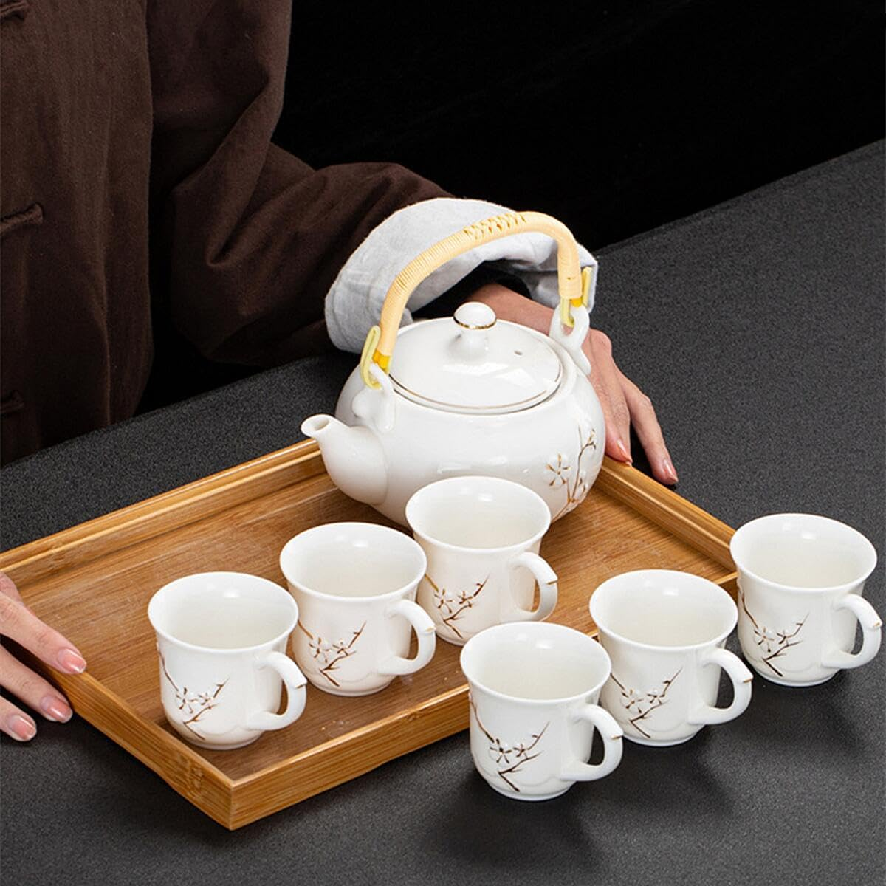
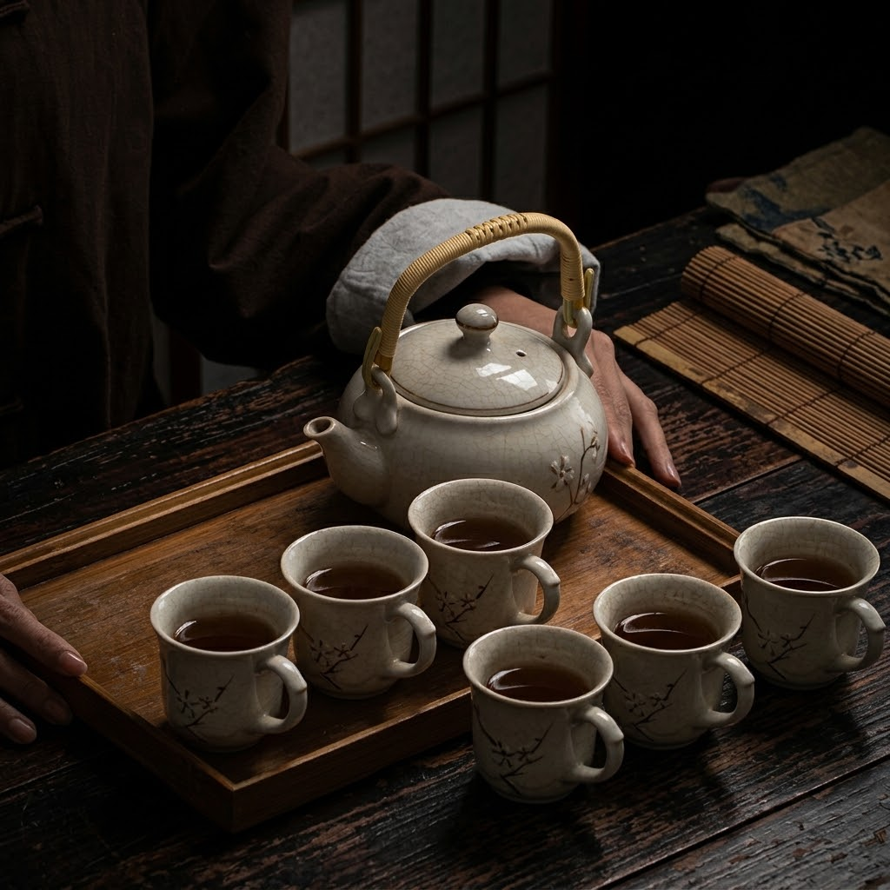
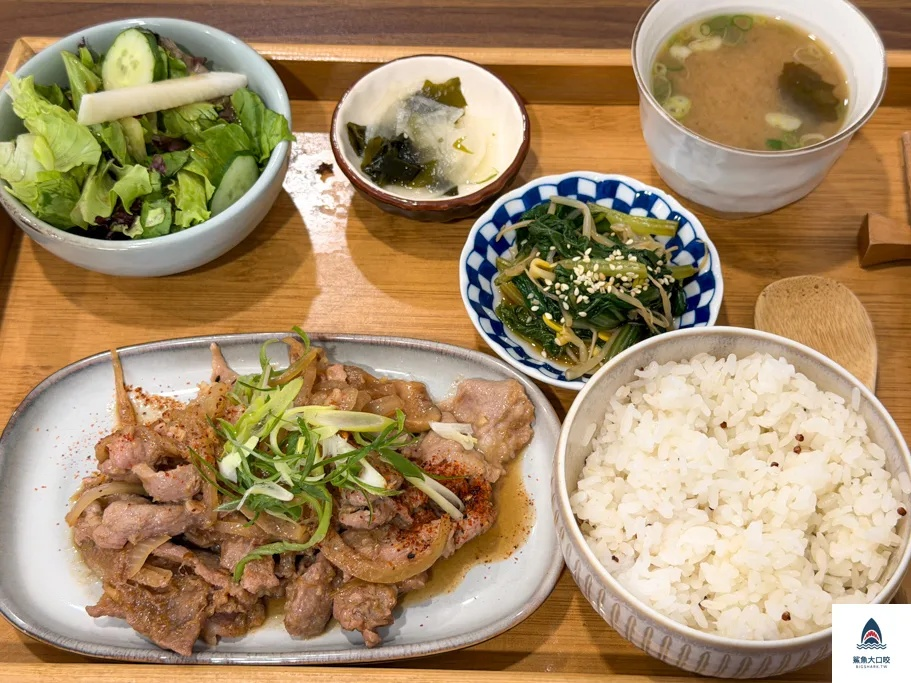
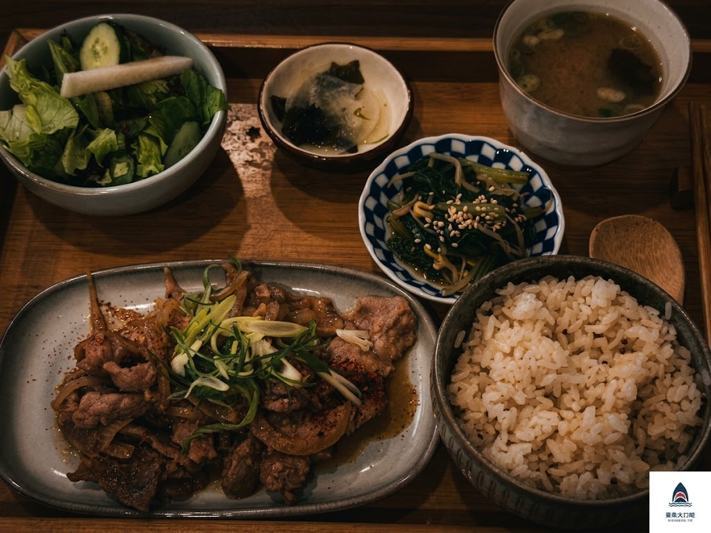

# 陰翳美学（inei-bigaku / Shadowism）

> 「美は物体にあるのではなく、物体と物体との作り出す陰翳のあや、明暗にある」——谷崎潤一郎『陰翳礼讃』

基于谷崎润一郎《阴翳礼赞》东方幽玄哲学的 AI 画风转换与艺术再诠释 Skill。

---

## 效果展示（Before & After）

### 1. 茶席与器物（Still Life & Teaware）
> *剥离现代商业棚拍的平光泛白，以障子侧光唤醒白瓷温润的开片肌理，杯盏盛茶，沉入老木深暗。*

| 转换前（原片：电商平铺陈列） | 转换后（阴翳美学：境界一·残光清寂） |
| :---: | :---: |
|  |  |

---

### 2. 食之阴翳·日式定食（Food & Teishoku）
> *谷崎在《阴翳礼赞》中感叹：“白饭盛于黑漆器中，在暗处泛出珍珠般微光；若置于白盘强光下，便索然无味”。撤去餐厅均质荧光，令米饭与汤肴的温度在深沉暗影中复苏。*

| 转换前（原片：餐厅顶灯日光） | 转换后（阴翳美学：幽暗中的滋味） |
| :---: | :---: |
|  |  |

---

## 目录结构

```text
├── assets/                               # 效果展示图片
│   ├── teaset-before.jpg
│   ├── teaset-after.jpg
│   ├── teishoku-before.jpg
│   └── teishoku-after.jpg
├── inei-bigaku/
│   ├── SKILL.md                          # 技能主指令与核心规范
│   ├── evals/
│   │   └── evals.json                    # 测试用例与评估基准
│   └── references/
│       ├── aesthetics.md                 # 《阴翳礼赞》美学原理与题材对照表
│       ├── masters.md                    # 视觉大师参照（王家卫、宫川一夫、霍珀等）
│       ├── optics-and-palette.md         # 文学到光学渲染语言对照表与色彩规范
│       ├── portrait.md                   # 人像阴翳规范（避免恐怖谷、次表面暖光与电影构图）
│       └── prompt-templates.md           # Gemini / Midjourney / SD 专属提示词模板
├── inei-bigaku.skill                     # 打包分发文件
└── README.md
```

## 核心设计原则

1. **构图大减法（Subtractive Composition）**：斩断杂物与商品陈列感，画面 75% 浸入富有呼吸感的层叠暗影。
2. **光之刺点（Punctum）**：暗夜中必有一处摄人心魄的微光（熏金莳绘、若隐若现的水汽、或玉石白瓷的内蕴透光）。
3. **光学工程化（Optics Translation）**：将文学修辞转化为扩散模型可精确理解的物理光学语言（次表面散射 `subsurface scattering`、微划痕哑光包浆 `micro-scratched matte patina`、平方反比光线衰减 `inverse-square falloff` 等）。
4. **两重境界**：
   - **【残光·清寂】**：冷色天窗/障子透光、极简素陶、袅袅茶汽。
   - **【金幽·绚烂】**：低位烛火、黑漆浓夜、熏金莳绘微芒。

## 适用平台
- Google Antigravity / Gemini
- Midjourney
- Stable Diffusion / Flux
